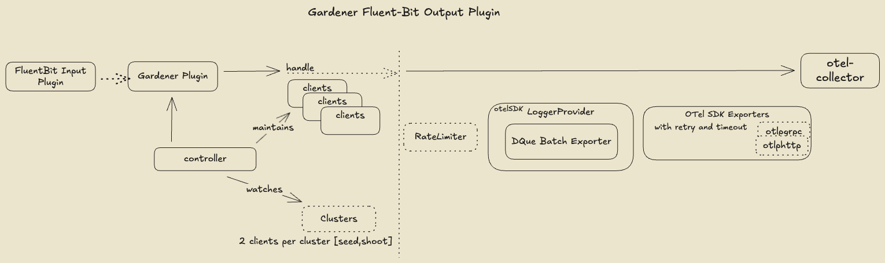

# Gardener Fluent Bit OTLP Output Plugin


[](https://api.reuse.software/info/github.com/gardener/logging)
[](https://github.com/gardener/logging/actions/workflows/non-release.yaml)
[](https://goreportcard.com/report/github.com/gardener/logging)
[](LICENSE)
[](https://github.com/gardener/logging)
[](https://pkg.go.dev/github.com/gardener/logging)

A modern Fluent Bit output plugin for [Gardener](https://gardener.cloud/) that ships logs using the **OpenTelemetry Protocol (OTLP)**. This plugin enables standardized, vendor-neutral log forwarding from Fluent Bit to any OTLP-compatible backend (VictoriaLogs, Loki, ClickHouse, etc.) with support for dynamic routing to multiple destinations based on Kubernetes cluster metadata.

## Overview

The Gardener OTLP plugin represents Gardener's evolution toward **Observability 2.0**, embracing OpenTelemetry standards for unified, interoperable observability. It provides:

- **OpenTelemetry Protocol Support**: Native OTLP over gRPC and HTTP
- **Dynamic Multi-Target Routing**: Automatically routes logs to different backends based on Kubernetes cluster state
- **Persistent Buffering**: Disk-backed queuing (dque) prevents log loss during backend outages
- **Enterprise Features**: TLS/mTLS, rate limiting, retries with exponential backoff, and batch processing
- **Kubernetes-Native**: Seamless integration with Gardener's Shoot and Seed cluster architecture
- **Production-Ready**: Prometheus metrics, health checks, and pprof profiling support



## Key Features

### OTLP Protocol Support
- **OTLP/gRPC**: High-performance binary protocol with bi-directional streaming
- **OTLP/HTTP**: Firewall-friendly HTTP/1.1 and HTTP/2 support with JSON or Protobuf encoding
- **OpenTelemetry Standards**: Full compliance with OTLP log data model and semantic conventions

### Dynamic Multi-Cluster Routing
- **Intelligent Routing**: Automatically determines target backends based on Kubernetes namespace and cluster state
- **Cluster State Awareness**: Routes logs differently based on cluster lifecycle (Ready, Hibernating, Deletion, etc.)
- **Seed and Shoot Support**: Separate client configurations for Gardener Seed and Shoot clusters

### Reliability & Performance
- **Persistent Buffering**: Disk-based queue (dque) with configurable segment size and sync modes
- **Batch Processing**: Efficient batching with configurable size and timeout parameters
- **Retry Logic**: Exponential backoff with configurable initial/max intervals and elapsed time
- **Rate Limiting**: Optional throttling to prevent overwhelming backends
- **Backpressure Handling**: Queue-based buffering prevents memory exhaustion under high load

### Security & Compliance
- **TLS/mTLS**: Full TLS 1.2+ support with certificate authentication
- **Secure Defaults**: TLS enabled by default with configurable certificate validation
- **Header-based Auth**: Custom headers support for token-based authentication

### Observability
- **Prometheus Metrics**: Comprehensive metrics for monitoring client behavior, queue depth, export latency
- **Health Checks**: `/healthz` endpoint for liveness/readiness probes
- **Debug Support**: pprof profiling endpoints for troubleshooting

## Quick Start

### Installation

```bash
# Build the plugin
make plugin

# Run with Fluent Bit
fluent-bit -e ./build/output_plugin.so -c fluent-bit.conf
```

### Basic Configuration

```ini
[Output]
    Name gardener
    Match kubernetes.*
    SeedType OTLPGRPC
    Endpoint victorialogs.logging.svc:4317
    LogLevel info
```

See [Usage Guide](docs/usage.md) for detailed installation and usage instructions.

## Observability 2.0

This plugin is part of Gardener's evolution toward **Observability 2.0**, a modern approach to unified observability using OpenTelemetry standards.

📖 **[Gardener Observability 2.0: A Unified Approach](docs/observability-2.0/Observability%202.0.md)**

### Roadmap Status

The OTLP plugin implementation represents **Step 5** in Gardener's Observability 2.0 roadmap:

1. ✅ Gardener OpenTelemetry Collector Distribution
2. ✅ OpenTelemetry Operator for Seeds
3. 🔄 Migrate Shoot log shippers from Valitail to OTel Collector
4. 🔄 Format Fluent Bit inputs as OTLP logs
5. ✅ **OTLP in Fluent Bit Output - Gardener Logging Plugin** (This project)
6. 🔄 VictoriaLogs in Shoot Control Plane namespaces
7. 🔄 OTel Collector extension for Shoots
8. 🔄 Unified visualization

## Documentation

### User Guides
- **[Configuration Guide](docs/configuration.md)** - Complete configuration reference with examples
- **[Usage Guide](docs/usage.md)** - Installation and usage instructions
- **[Troubleshooting Guide](docs/troubleshooting.md)** - Common issues and solutions

### Technical Documentation
- **[Architecture](docs/architecture.md)** - Design and component details
- **[Monitoring & Metrics](docs/monitoring.md)** - Metrics, alerts, and observability
- **[Client Package Documentation](pkg/client/README.md)** - Detailed client implementation docs

## Supported Backends

This plugin is compatible with any backend that supports OTLP log ingestion:

- **[VictoriaLogs](https://docs.victoriametrics.com/victorialogs/)** - High-performance log storage
- **[Loki](https://grafana.com/oss/loki/)** - Horizontally-scalable log aggregation
- **[ClickHouse](https://clickhouse.com/)** - Fast OLAP database
- **[OpenTelemetry Collector](https://opentelemetry.io/docs/collector/)** - Vendor-agnostic data pipeline


## Contributing

Contributions are welcome! Please:

1. Read [CONTRIBUTING.md](CONTRIBUTING.md)
2. Follow the [Gardener coding conventions](.github/copilot-instructions.md)
3. Submit a pull request with tests

## License

This project is licensed under the Apache License 2.0 - see the [LICENSE](LICENSE) file for details.

## Links

- **Gardener Project**: [https://gardener.cloud/](https://gardener.cloud/)
- **OpenTelemetry**: [https://opentelemetry.io/](https://opentelemetry.io/)
- **Documentation**: [docs/](docs/)
- **GitHub Issues**: [https://github.com/gardener/logging/issues](https://github.com/gardener/logging/issues)

## Support

For questions or issues:

- **GitHub Issues**: [https://github.com/gardener/logging/issues](https://github.com/gardener/logging/issues)
- **Gardener Slack**: [#gardener](https://kubernetes.slack.com/messages/gardener) on Kubernetes Slack

