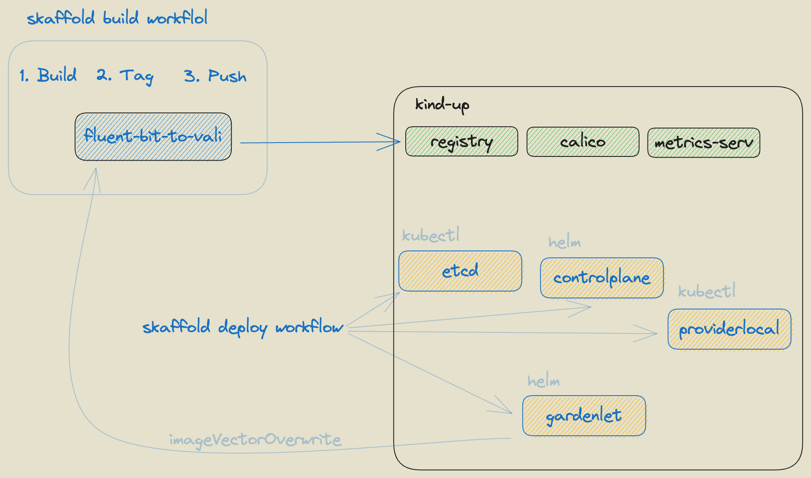

# Development scenarios for the logging stack

## Skaffold based development scenario for fluent-bit-vali-plugin

It is possible to construct a local development environment for the logging stack based on [skaffold]
(https://skaffold.dev). It builds upon the gardener `skaffold` pipeline and provides a hook for building and
deploying the `fluent-bit-plugin` into the local development kind cluster.



To bring the development environment first we need to bring a local kind cluster with a default set of workloads required by gardener. The simplest way to achieve this is to fetch the gardener repository into the local project folder and leverage the already existing targets.

To fetch a gardener repository, in case it is not already fetched, invoke the following command.
```bash
hack/fetch-gardener.sh
```

It tries to get the version of which gardener release to fetch from the dependency defined in the project `go.mod` file.
Once the gardener repository is fetched, initiate the kind cluster with:
```bash
make -C gardener kind-up
```

In addition to the kind cluster itself, the `kind-up` target brings also the following dependencies: 
- `docker registry`
- `calico`
- `metrics-server`

Once the kind cluster is up and running we can start the `skaffold` local pipeline with the following command:
```bash
make skaffold-run
```
This `make` target runs the skaffold `run` workflow executing the pipeline according the specified [skaffold.yaml](/skaffold.yaml) 
configuration.

The [skaffold.yaml](/skaffold.yaml) definition brings:
- `etcd`
- `controlplane`
- `provider local`
- `gardenlet`

skaffold modules into 
the local kind cluster. The last `gardenlet` module contains the build target for generating the `fluent-bit-plugin` 
container image and it pushes it to the local registry already present in the local kind cluster. When the skaffold 
deployment workflow is triggered, the `fluent-bit-plugin` is brought into the cluster with the gardenlet specific 
deployment 
model.

After the `skaffold-run` target is executed the skaffold pipeline may be started in the `dev` mode with
```bash
make skaffold-dev
```

That brings the ability of the pipeline to listen for modifications and trigger the update of the entire pipeline 
once such modifications are present.

To clean up the environment set up by the pipeline, use the `kind-down` target from the fetched gardener repository.
```bash
make -C gardener kind-down
```
or simply delete the kind cluster with `kind`
```bash
kind delete cluster --name gardener-local
```