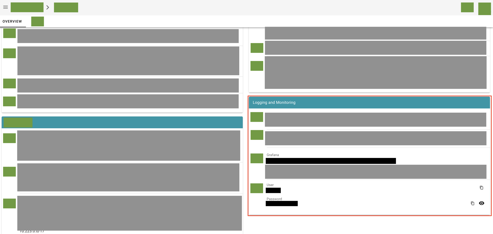
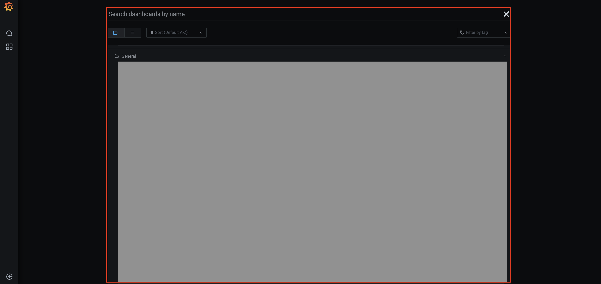
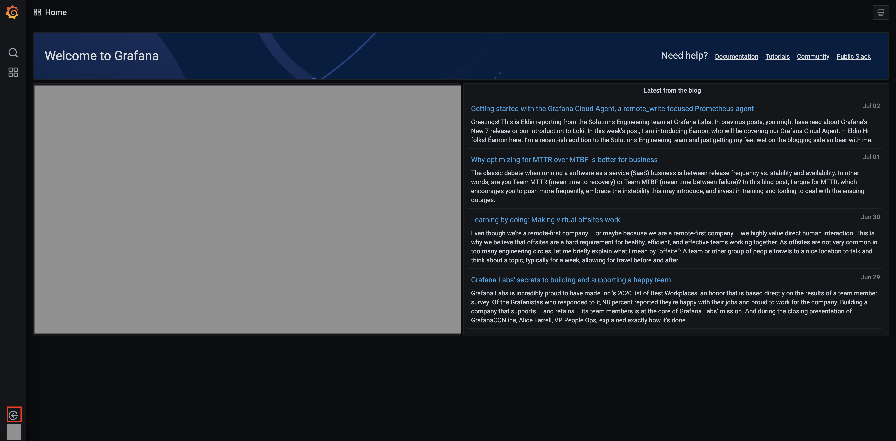
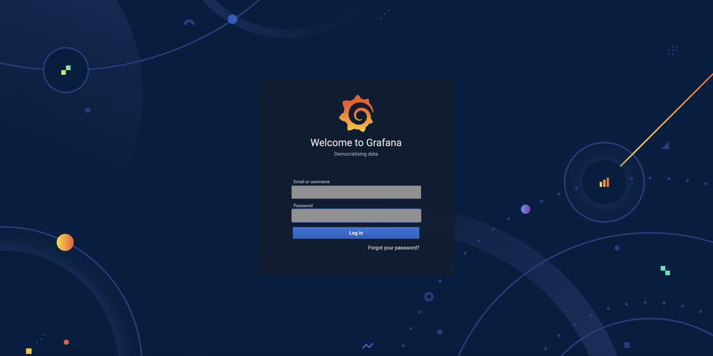
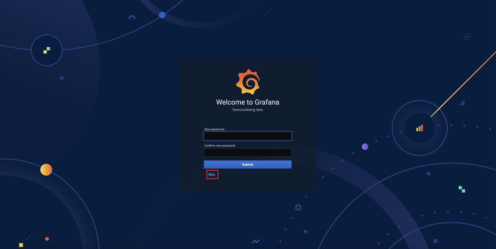
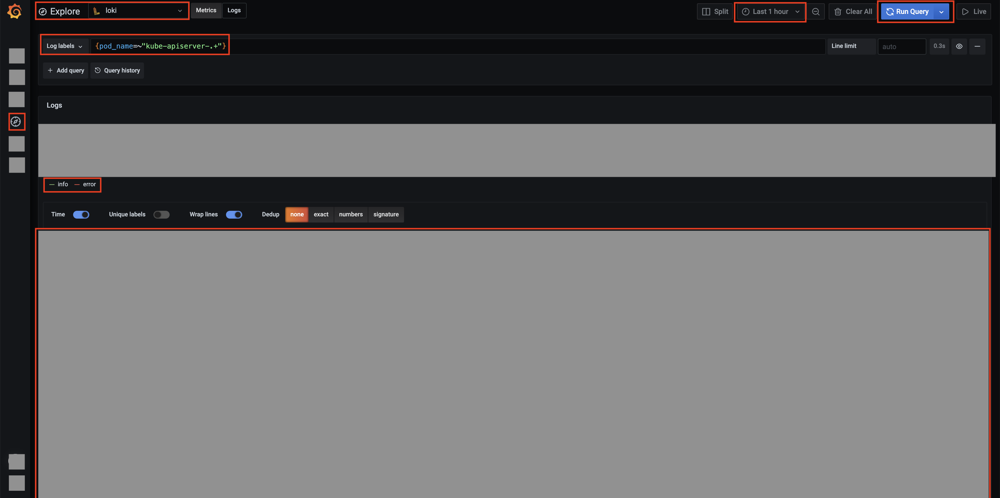

This guide is about Gardener Logging, how it is organized and how to use the dashboard for viewing the Kubernetes clusters log data.

## Cluster level logging
Log data is fundamental for the successful operation activities of Kubernetes landscapes. It is used for investigating problems and monitoring cluster activity. 

Cluster level logging is the recommended way to collect and store log data for Kubernetes cluster resources. With cluster level logging the log data is externalized 
in a logging backend where the log lifecycle management is independent from the lifecycle management of the Kubernetes resources.

Cluster level logging is not available by default with [Kubernetes](https://kubernetes.io/docs/concepts/cluster-administration/logging/#cluster-level-logging-architectures) and consumers have to implement it in addition.
Kubernetes project provides only basic logging capabilities via _kubectl logs_ where the kubelet keeps one terminated container with its logs. 
When a pod is evicted from the node, all corresponding containers are also evicted, together with their logs. 
This is why the default log storage solution is considerd shot-lived and not sufficient when one wants to operate properly a Kubernetes environment. 

Gardener, as an advanced Kubernetes management solution, follows the general recommendations and offers a cluster level logging solution to ensure proper log storage for all managed Kubernetes resources. 
The log management is setup when the new cluster is created.
Log collection is organized using [fluent-bit](https://fluentbit.io). 
Log storage and search is organized using [Loki](https://grafana.com/oss/loki). 
Log visualization is available using [Grafana](hhttps://grafana.com/grafana) that is deployed with 
predefined dashboard and  visualization for every shoot cluster.


Kubernetes operators can benefit from different capabilities like accessing the logs for 
already terminated containers, perform fast and sophisticated search for investigating long 
lasting problems or recurring problems based on logs from a long period of time. 

Below in this guide, you will find the procedure how to access the log data for your clsuters.

## Procedure

Use this procedure to view the log data of your Kubernetes cluster.

### Accessing Grafana
1. Open **Gardener dashboard** and navigate to the cluster which log data you want to view
2. Hover your mouse over cluster name to open and view the details for the cluster. Find the **Logging and Monitoring** section and use the link and credentials to log-in to Grafana.



### Using Grafana

There are two ways for tracking log messages in Grafana.

#### Predefined Dashboards
The first option is to use the predefined dashboards.
Go to the **Home** menu and after that you can choose which dashboard to open. The dashboards which contain log visualizations for the different Grafana deployments are:

  * Garden Grafana
    * Pod Logs
    * Extensions
    * Systemd Logs
  * User Grafana
    * Kubernetes Control Plane Status
  * Operator Grafana 
    * Kubernetes Pods
    * Kubernetes Control Plane Status



#### Explore menu
The second option is to use the **Explore** menu.
The first thing for enabling this option is to authenticate in front of the Grafana UI.
This happens with the button in the bottom left corner


The default credentials for the Grafana are:
`username` : `admin`
`password` : `admin`


On successful login you will be asked for changing the default password. Please ***do not*** do that because these credentials will be used from all of the operators so this step ***should be skipped***.



After that just select the ***Explore*** (Left side of the screen) menu.



There you can create a custom log filters based on the predefined labels used in `Loki`

The following properties can be managed in the `Explore` menu:

1) `Datasource` (top left corner) should be set on Loki
2) `Timerange` (top right corner) is used to filter logs over a different period of time
3) `Label Selector` (top left corner) is used to filter logs based on the `Loki`'s labels and their values. 
For example: 
`pod_name="kube-apiserver-1234-1234"` or you can use a regex: `pod_name=~"kube-apiserver.+"`
4) `Severity` (left side of the screen). This option is used to filter log messages with specific severity.

Lastly click on **Run Query** (top right corner) and the log messages which fit on the properties listed above will be displayed.

## Using log data for a problem resolution
**Sample problem:** 

Kubernetes cluster appears in "Error state" after changing the **admissionPlugins** configuration of the **kubeAPIServer** (for an existing cluster) using the code below:
   ```bash
  kubernetes:
    allowPrivilegedContainers: true
    kubeAPIServer:
      admissionPlugins:
      - name: Initializers
   ```
**Problem investigation:**

The operator is looking for error messages in the log data created regarding kubeAPIServer that can explain the error state of the cluster. 

As part of the log data there is an Error message with the following content: 
   ```
Error: enable-admission-plugins plugin "Initializers" is unknown
   ```

Based on this data, the operators finds out that the **admissionPlugins** of the **kubeAPIServer**  is configured with a wrong admission plugin data. 
Once the configuration is fixed the cluster will be reconciled successfully.


